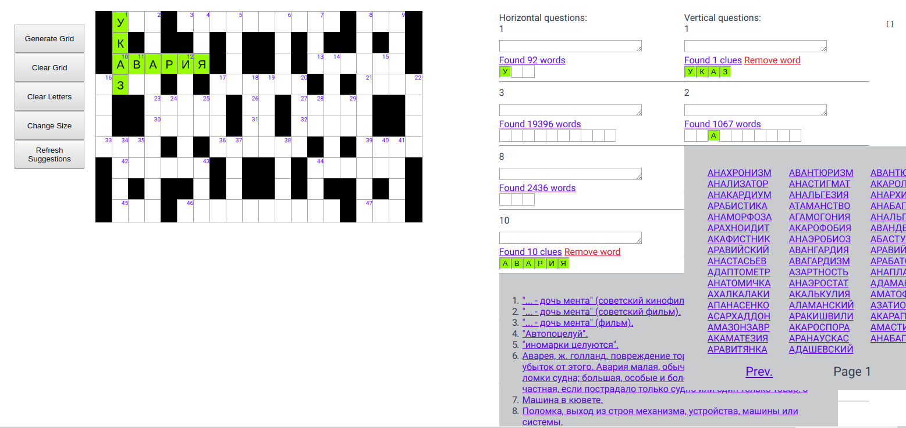

# Vue Crossword

[](https://travis-ci.com/Piterden/vue-crossword)

A Vue.js based crossword puzzle builder and filler front-end application.



## Demo

[**Russian Words DB Demo**](https://0l3q5ozyl.codesandbox.io/)

## Features

- [x] Supports 2-31 symbols words lengths.
- [x] Supports any grid size.
- [x] Random symmetric grid generator.
- [x] Automatic calculation of required to fill letter cells and clues numeration.
- [x] Words suggestions from API depending on length and filled letters.
- [x] Clues suggestions for filled words from API.

## ToDo

- [ ] User login (OAuth2).
- [ ] Save built crosswords.
- [ ] Add and save new words and clues.
- [ ] Search within suggested words by added letters.
- [ ] Search in clues of suggested words.
- [ ] Add taxonomy for clues.
- [ ] Automatic generation of full filled crossword.
- [ ] Add different types of symmetry to grid generation.
- [ ] Add analyzer and smart corrector for generated grids (to control words length).
- [ ] Improve the logic of API queries.
- [ ] Make a print version.
- [ ] Fix mobile version.

## Usage

There are a few simple rules:

- Generated forms of vertical and horizontal questions allow you to fill cells inside them with letters.
- Grid cells do not allow you to fill them with letters but you can edit a grid geometry by clicking on them.
- You can change the size of a grid pressing the `Change Size` button which enables *the size change mode*. In this mode requests to the API are temporarily disabled and suggesting words would be updated on exit to the normal edit mode.
- When word is filled, you could select the clue or enter your one. The cells of filled words are marked with a green color.

## Build Setup

``` bash
# install dependencies
npm i

# serve with hot reload at localhost:8080
npm run dev

# build for production with minification
npm run build

# build for production and view the bundle analyzer report
npm run build --report

# run unit tests
npm run unit

# run e2e tests
npm run e2e

# run all tests
npm test
```

## Built With

- [VueJS](https://vuejs.org/) - The Progressive JavaScript Framework.
- [CodeSandbox](https://codesandbox.io) - The online code editor for ...

## Contributing

PR's are appreciated.

## Authors

- **Denis Efremov** - *Code|Idea* - [Piterden](https://github.com/Piterden)

## License

This project is licensed under the MIT License - see the [LICENSE.md](https://github.com/Piterden/chessbot/blob/master/LICENSE.md) file for details